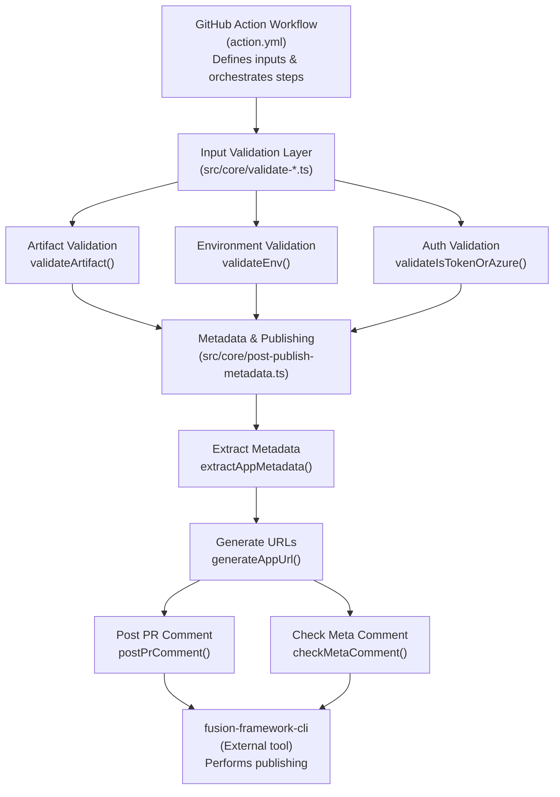
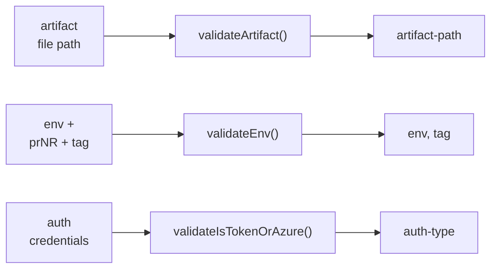
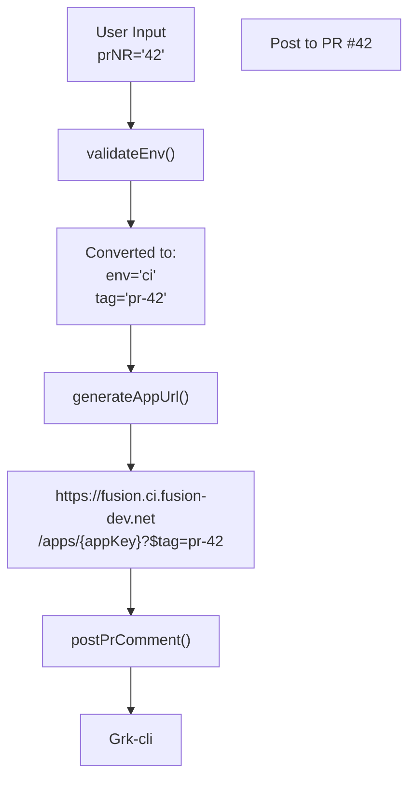

# Architecture Documentation

## Overview

**Fusion Action App Publish** is a GitHub Action that authenticates and publishes Fusion applications using the `@equinor/fusion-framework-cli`. The action provides a complete workflow for:

- Validating application artifacts and deployment parameters
- Authenticating using either direct tokens or Azure Service Principal (OIDC)
- Extracting application metadata from build artifacts
- Generating deployment information and posting to GitHub PRs

## System Architecture



## Module Structure

### `/src/index.ts`
**Main Entry Point**

Exports the public API of the library. All validation and publishing functions are re-exported here for clean module access.

```typescript
export { validateArtifact };
export { validateEnv };
export { validateIsTokenOrAzure };
export { extractAppMetadata, generateAppUrl, postPrComment };
```

### `/src/core/` - Core Business Logic

#### `validate-artifact.ts`
**Artifact Validation**

- Verifies artifact input is provided
- Checks file exists on filesystem
- Ensures file is `.zip` format
- Sets `artifact-path` output for downstream steps

**Key Functions:**
- `validateArtifact()`: Main validation function

**GitHub Action Integration:**
- Reads input: `artifact`
- Sets output: `artifact-path`

---

#### `validate-env.ts`
**Environment & Deployment Target Validation**

Handles deployment environment configuration with special logic for PR preview deployments:

- **Standard Deployments**: Validates `env` input (ci, tr, fprd, fqa, next) and requires `tag`
- **PR Previews**: When `prNR` provided, sets environment to `ci` with tag `pr-{number}`

This enables automatic preview deployments on pull requests without duplicating production environment settings.

**Key Functions:**
- `validateEnv()`: Validates environment inputs

**GitHub Action Integration:**
- Reads inputs: `env`, `prNR`, `tag`
- Sets outputs: `env`, `tag`

**Example PR Flow:**
```
User input: prNR=42
↓
validateEnv()
↓
Output: env='ci', tag='pr-42'
↓
Creates deployment: https://fusion.ci.fusion-dev.net/apps/{appKey}?$tag=pr-42
```

---

#### `validate-is-token-or-azure.ts`
**Authentication Validation & Detection**

Supports two authentication methods with automatic detection:

1. **Direct Token Authentication**
   - User provides pre-acquired Fusion API token
   - Format: `BEARER {token}`
   - Use when you already have valid Fusion credentials

2. **Azure Service Principal (OIDC)**
   - Uses GitHub's OIDC for secure credential exchange
   - Requires: `azure-client-id`, `azure-tenant-id`, `azure-resource-id`
   - More secure for cloud environments

**Detection Priority** (when both provided):
- Service Principal takes precedence when all credentials available
- Falls back to token if only token provided

**Key Functions:**
- `validateFusionToken()`: Validates token format (BEARER prefix + valid chars)
- `detectAndValidateAuthType()`: Detects auth type and validates credentials
- `validateIsTokenOrAzure()`: Main orchestration function

**GitHub Action Integration:**
- Reads inputs: `fusion-token`, `azure-client-id`, `azure-tenant-id`, `azure-resource-id`
- Sets outputs: `auth-type`, `isToken`, `isServicePrincipal`

---

#### `post-publish-metadata.ts`
**Metadata Extraction & Deployment Info**

Extracts application information from the artifact and posts deployment details.

**Key Functions:**

- **`extractAppMetadata(artifactPath: string)`**
  - Executes `unzip -p {artifact} "*/metadata.json"`
  - Reads metadata without temporary file extraction (more secure)
  - Maps `name` field to `key` for URL generation
  - Parses and validates JSON structure
  
- **`generateAppUrl(meta, env, tag)`**
  - Creates environment-specific URLs
  - Adds tag as query parameter for non-latest deployments
  - Environment mapping:
    - `ci` → `https://fusion.ci.fusion-dev.net`
    - `fqa` → `https://fusion.fqa.fusion-dev.net`
    - `fprd` → `https://fusion.equinor.com` (production)
    - `tr` → `https://fusion.tr.fusion-dev.net`
    - `next` → `https://fusion.next.fusion-dev.net`

- **`postPrComment(meta, tag, appUrl)`**
  - Posts formatted Markdown comment to PR with:
    - Application name and deployed tag
    - Direct link to deployed application
    - Deployment metadata for tracking
  - Includes meta-comment identifier for deduplication checks
  - Silently skips if not in PR context

- **`postPublishMetadata()`**
  - Main orchestration function
  - Reads inputs: `artifact`, `env`, `tag`, `working-directory`
  - Sets multiple outputs for downstream steps:
    - `app-name`: Application name
    - `app-version`: Version from metadata
    - `app-url`: Generated application URL
    - `portal-url`: Fusion portal URL for app management
    - `target-env`: Resolved target environment
    - `publish-info`: Formatted summary for notifications

**GitHub Action Integration:**
- Reads inputs: `artifact`, `env`, `tag`, `working-directory`
- Sets outputs: `app-name`, `app-version`, `app-url`, `portal-url`, `target-env`, `publish-info`

---

#### `check-meta-comment.ts`
**PR Comment Deduplication**

Prevents duplicate PR comments when action runs multiple times:

- Queries GitHub API for existing comments on PR
- Searches for meta-comment identifier: `<!-- fusion-app-publish-meta -->`
- Returns early if comment already exists
- Enables conditional PR commenting in workflows

**Key Functions:**
- `checkMetaComment()`: Checks for existing meta comment

**GitHub Action Integration:**
- Reads environment: `GITHUB_TOKEN`, workflow context
- Reads inputs: `tag` (for PR number fallback)
- Sets output: `exists` ('true' or 'false')

---

### `/src/types/` - Type Definitions

#### `auth.ts`
```typescript
type AuthType = "token" | "service-principal";

interface ValidationResult {
  isValid: boolean;
  error: string | null;
}

interface AuthDetectionResult {
  authType: AuthType | null;
  isValid: boolean;
  error: string | null;
}

interface Credentials {
  fusionToken: string;
  azureClientId: string;
  azureTenantId: string;
  azureResourceId: string;
}
```

#### `fusion-app.ts`
Type definitions for Fusion applications and package metadata:
```typescript
interface FusionApp {
  name: string;
  path: string;
  version?: string;
}

interface PackageJson {
  name?: string;
  version?: string;
  dependencies?: Record<string, string>;
  devDependencies?: Record<string, string>;
  scripts?: Record<string, string>;
  [key: string]: unknown;
}
```

#### `metadata.ts`
```typescript
interface AppMetadata {
  name: string;              // Required: app name (mapped to key)
  version?: string;          // Optional: semantic version
  description?: string;      // Optional: human-readable description
  key: string;               // Unique identifier (set during extraction)
  entry?: {
    path?: string;           // Main entry file path
  };
  [key: string]: unknown;    // Allow additional properties
}

interface ExecResult {
  stdout: string;            // Command stdout
  stderr: string;            // Command stderr
}
```

---

## Data Flow

### Validation Phase


### Metadata & Publishing Phase
```mermaid
graph TD
    A["artifact-path"]
    B["extractAppMetadata()"]
   mermaid
sequenceDiagram
    participant User
    participant Action as GitHub Action
    participant Validator as validateFusionToken
    participant CLI as fusion-framework-cli
    
    User->>Action: fusion-token=BEARER xxx
    Action->>Validator: Validate token format
    Validator->>Validator: Check BEARER prefix
    Validator->>Validator: Validate characters
    Validator->>Action: Return valid result
    Action->>CLI: Pass token to CLI
    CLI->>CLI: Publish application
```

### Azure Service Principal (OIDC)
```mermaid
sequenceDiagram
    participant User
    participant Action as GitHub Action
    participant Validator as detectAndValidateAuthType
    participant Azure as Azure OIDC
    participant CLI as fusion-framework-cli
    
    User->>Action: azure-client-id, tenant-id, resource-id
    Action->>Validator: Validate all fields present
    Validator->>Validator: Check non-empty strings
    Validator->>Action: Return valid result
    Action->>Azure: Request token (OIDC)
    Azure->>Action: Return access token
    Action->>CLI: Pass credentials to CLI
    CLI->>CLI: Publish application
Pass to fusion-framework-cli for publishing
```
mermaid
graph TD
    A["User Input<br/>env='fprd'<br/>tag='v1.0.0'"]
    B["generateAppUrl()"]
    C["https://fusion.equinor.com<br/>/apps/{appKey}?$tag=v1.0.0"]
    D["postPrComment()"]
    E["Deploy to Production"]
    
    A --> B --> C
    C --> D --> E
```

### PR Preview Deployment


---

## PR Deployment Flow

### Standard Deployment (Production)
```
User: env='fprd', tag='v1.0.0'
  ↓
Environment: https://fusion.equinor.com/apps/{appKey}?$tag=v1.0.0
PR Comment: Posts link to deployed app
```

### PR Preview Deployment
```
User: prNR='42' (pull request #42)
  ↓
validateEnv() converts to: env='ci', tag='pr-42'
  ↓
Environment: https://fusion.ci.fusion-dev.net/apps/{appKey}?$tag=pr-42
PR Comment: Posts link to preview deployment
  ↓
Automatic comment posted to PR #42
```

---

## Error Handling

Each module follows a consistent error handling pattern:

1. **Validation Functions**: Use `core.setFailed()` and return early
2. **Async Functions**: Wrap in try-catch and use `core.setFailed()` on errors
3. **Non-blocking Operations**: Use `core.warning()` and continue (e.g., PR comments)

This ensures:
- Action fails fast on critical validation errors
- Warnings don't block deployment but are visible in logs
- GitHub Action output captures all error details

---

## Testing Strategy

The project maintains **100% test coverage** with comprehensive unit tests:

- **Validation Tests**: Verify correct acceptance/rejection of inputs
- **Integration Tests**: Test interaction between modules
- **Error Handling**: Ensure proper error messages and exit codes
- **Mock GitHub API**: Mock GitHub Actions context and API calls

Test files mirror source structure:
```
src/
├── core/
│   ├── validate-artifact.ts
│   └── validate-artifact.test.ts
├── types/
│   └── auth.ts  (types tested implicitly)
```

---

## Performance Considerations

### Metadata Extraction
- Uses `unzip -p` to read metadata directly from archive
- Avoids temporary file extraction (faster, more secure)
- Single process execution for efficiency

### API Calls
- Minimal GitHub API calls (only for PR comments and deduplication)
- Early return if not in PR context (GITHUB_TOKEN not available)

### Parallelization
- Validation steps can run in parallel in workflows
- Metadata extraction depends on artifact validation

---

## Security Considerations

1. **Token Handling**
   - Tokens marked as GitHub secrets (redacted in logs)
   - Not written to filesystem
   - Only passed to CLI via environment/args

2. **Azure Credentials**
   - Uses OIDC (no static secrets in repository)
   - Credentials fetched fresh for each deployment
   - Token lifespan limited by GitHub Actions

3. **Artifact Processing**
   - No temp file extraction (zip read streamed)
   - File path validated and resolved safely
   - Extension check prevents file type confusion

4. **PR Comments**
   - Only posts to authorized PR context
   - Uses meta-comment identifier to prevent duplication
   - Comments include timestamp for tracking

---

## Extension Points

### Adding New Environments
Update `validateEnv.ts` and `generateAppUrl()`:
```typescript
const envUrls: Record<string, string> = {
  // ... existing environments
  "my-env": "https://fusion.my-env.net",
};
```

### Adding New Metadata Fields
Extend `AppMetadata` interface in `metadata.ts`:
```typescript
interface AppMetadata {
  // ... existing fields
  customField?: string;
}
```

### Adding New Authentication Methods
Create new validation function and extend `AuthType`:
```typescript
export type AuthType = "token" | "service-principal" | "oauth";
```

---

## Dependencies

### Runtime
- `@actions/core`: GitHub Actions toolkit
- `@actions/github`: GitHub API access
- Node.js built-ins: `child_process`, `fs`, `path`, `util`

### Development
- `vitest`: Test runner
- `@vitest/coverage-v8`: Code coverage
- `biome`: Linter and formatter
- `typescript`: Type checking

---

## Related Documentation

- [README.md](README.md) - Usage guide and examples
- [CONTRIBUTING.md](CONTRIBUTING.md) - Development guide
- [PUBLISHING.md](PUBLISHING.md) - Release process
- [action.yml](action.yml) - GitHub Action interface definition
