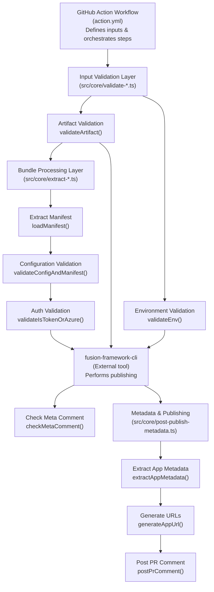
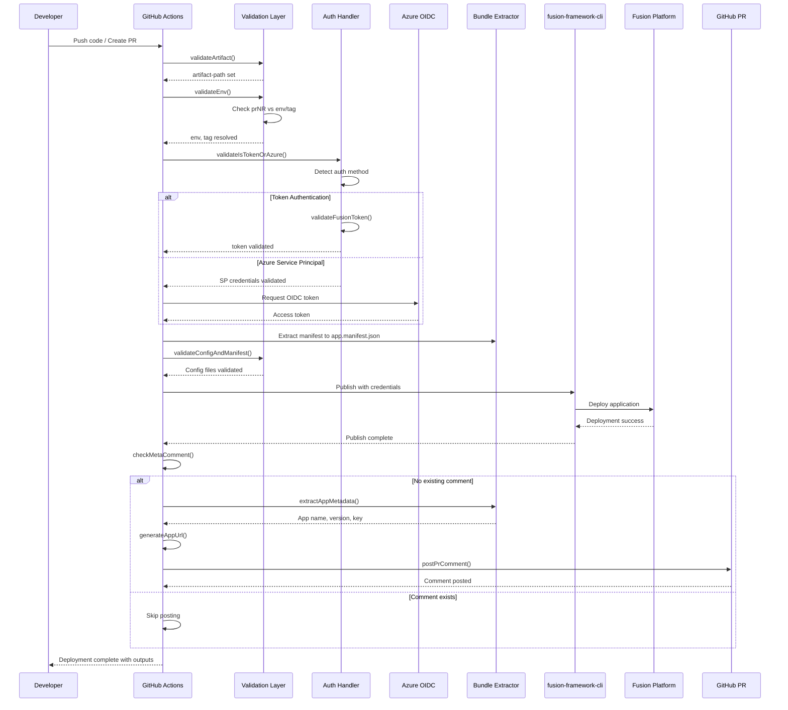
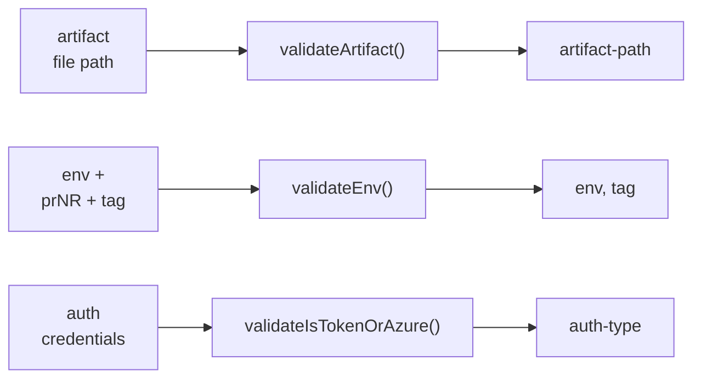
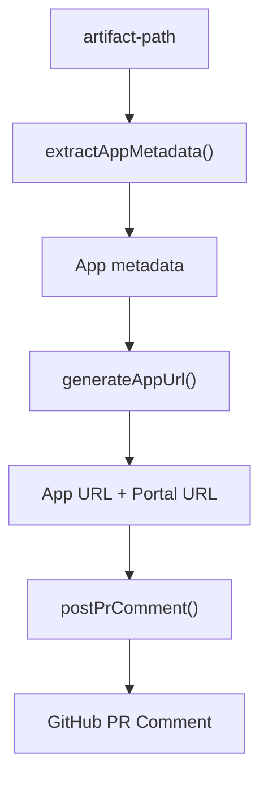
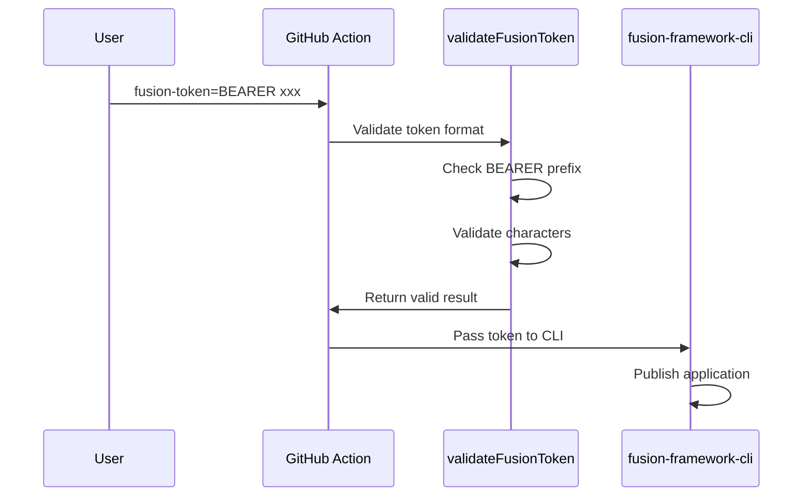
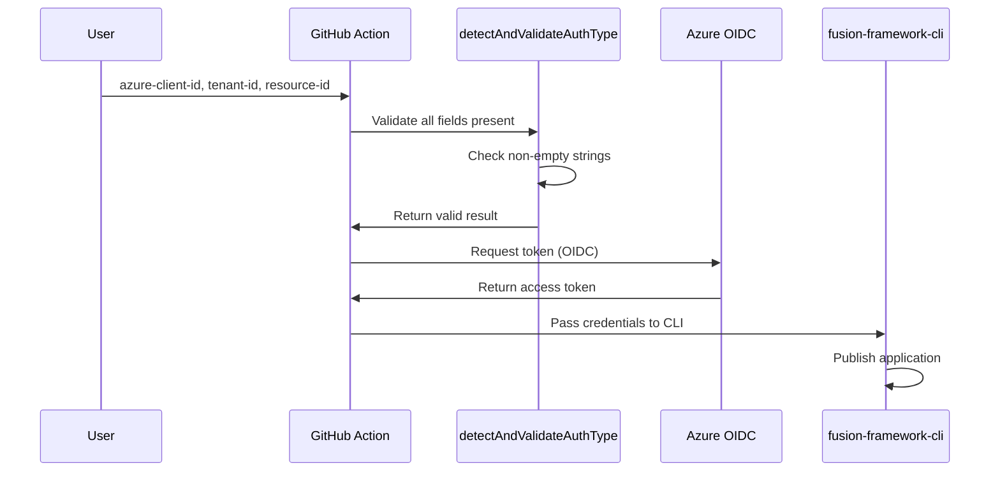
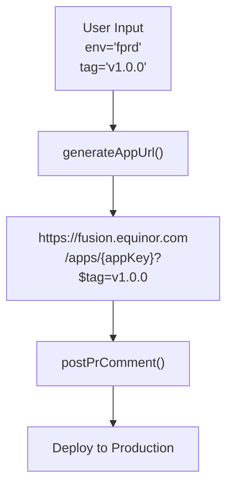
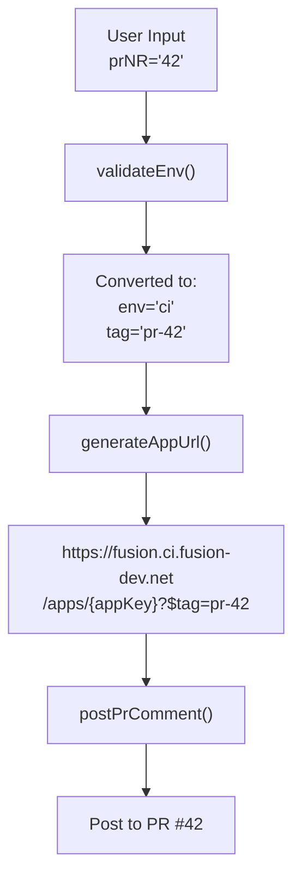

# Architecture Documentation

## Overview

**Fusion Action App Publish** is a GitHub Action that authenticates and publishes Fusion applications using the `@equinor/fusion-framework-cli`. The action provides a complete workflow for:

- Validating application artifacts and deployment parameters
- Authenticating using either direct tokens or Azure Service Principal (OIDC)
- Extracting application metadata from build artifacts
- Generating deployment information and posting to GitHub PRs

## System Architecture



## Module Structure

### `/src/index.ts`
**Main Entry Point**

Exports the public API of the library. All validation and publishing functions are re-exported here for clean module access.

```typescript
export { checkMetaComment };
export { loadManifest };
export { loadMetadata };
export { extractAppMetadata, generateAppUrl, postPrComment, postPublishMetadata };
export { validateArtifact };
export { validateConfigAndManifest };  
export { validateEnv };
export { validateIsTokenOrAzure };
export * from "./types";
```

### `/src/core/` - Core Business Logic

#### `validate-artifact.ts`
**Artifact Validation**

- Verifies artifact input is provided
- Checks file exists on filesystem
- Ensures file is `.zip` format
- Sets `artifact-path` output for downstream steps

**Key Functions:**
- `validateArtifact()`: Main validation function

**GitHub Action Integration:**
- Reads input: `artifact`
- Sets output: `artifact-path`

---

#### `validate-env.ts`
**Environment & Deployment Target Validation**

Handles deployment environment configuration with special logic for PR preview deployments:

- **Standard Deployments**: Validates `env` input (ci, tr, fprd, fqa, next) and requires `tag`
- **PR Previews**: When `prNR` provided, sets environment to `ci` with tag `pr-{number}`

This enables automatic preview deployments on pull requests without duplicating production environment settings.

**Key Functions:**
- `validateEnv()`: Validates environment inputs

**GitHub Action Integration:**
- Reads inputs: `env`, `prNR`, `tag`
- Sets outputs: `env`, `tag`

**Example PR Flow:**
```
User input: prNR=42
↓
validateEnv()
↓
Output: env='ci', tag='pr-42'
↓
Creates deployment: https://fusion.ci.fusion-dev.net/apps/{appKey}?$tag=pr-42
```

---

#### `validate-is-token-or-azure.ts`
**Authentication Validation & Detection**

Supports two authentication methods with automatic detection:

1. **Direct Token Authentication**
   - User provides pre-acquired Fusion API token
   - Format: `BEARER {token}`
   - Use when you already have valid Fusion credentials

2. **Azure Service Principal (OIDC)**
   - Uses GitHub's OIDC for secure credential exchange
   - Requires: `azure-client-id`, `azure-tenant-id`, `azure-resource-id`
   - More secure for cloud environments

**Detection Priority** (when both provided):
- Service Principal takes precedence when all credentials available
- Falls back to token if only token provided

**Key Functions:**
- `validateFusionToken()`: Validates token format (BEARER prefix + valid chars)
- `detectAndValidateAuthType()`: Detects auth type and validates credentials
- `validateIsTokenOrAzure()`: Main orchestration function

**GitHub Action Integration:**
- Reads inputs: `fusion-token`, `azure-client-id`, `azure-tenant-id`, `azure-resource-id`
- Sets outputs: `auth-type`, `isToken`, `isServicePrincipal`

---

#### `post-publish-metadata.ts`
**Metadata Extraction & Deployment Info**

Extracts application information from the artifact and posts deployment details.

**Key Functions:**

- **`extractAppMetadata(artifactPath: string)`**
  - Executes `unzip -p {artifact} "*/metadata.json"`
  - Reads metadata without temporary file extraction (more secure)
  - Maps `name` field to `key` for URL generation
  - Parses and validates JSON structure
  
- **`generateAppUrl(meta, env, tag)`**
  - Creates environment-specific URLs
  - Adds tag as query parameter for non-latest deployments
  - Environment mapping:
    - `ci` → `https://fusion.ci.fusion-dev.net`
    - `fqa` → `https://fusion.fqa.fusion-dev.net`
    - `fprd` → `https://fusion.equinor.com` (production)
    - `tr` → `https://fusion.tr.fusion-dev.net`
    - `next` → `https://fusion.next.fusion-dev.net`

- **`postPrComment(meta, tag, appUrl)`**
  - Posts formatted Markdown comment to PR with:
    - Application name and deployed tag
    - Direct link to deployed application
    - Deployment metadata for tracking
  - Includes meta-comment identifier for deduplication checks
  - Silently skips if not in PR context

- **`postPublishMetadata()`**
  - Main orchestration function
  - Reads inputs: `artifact`, `env`, `tag`, `working-directory`
  - Sets multiple outputs for downstream steps:
    - `app-name`: Application name
    - `app-version`: Version from metadata
    - `app-url`: Generated application URL
    - `portal-url`: Fusion portal URL for app management
    - `target-env`: Resolved target environment
    - `publish-info`: Formatted summary for notifications

**GitHub Action Integration:**
- Reads inputs: `artifact`, `env`, `tag`, `working-directory`
- Sets outputs: `app-name`, `app-version`, `app-url`, `portal-url`, `target-env`, `publish-info`

---

#### `check-meta-comment.ts`
**PR Comment Deduplication**

Prevents duplicate PR comments when action runs multiple times:

- Queries GitHub API for existing comments on PR
- Searches for meta-comment identifier: `<!-- fusion-app-publish-meta -->`
- Returns early if comment already exists
- Enables conditional PR commenting in workflows

**Key Functions:**
- `checkMetaComment()`: Checks for existing meta comment

**GitHub Action Integration:**
- Reads environment: `GITHUB_TOKEN`, workflow context
- Reads inputs: `tag` (for PR number fallback)
- Sets output: `exists` ('true' or 'false')

---

#### `extract-manifest.ts`
**Application Manifest Extraction**

Extracts and loads the `app-manifest.json` file from Fusion application bundles. The manifest contains essential deployment configuration including the `appKey` used for identifying and configuring the application in the Fusion platform.

**Key Functions:**
- `loadManifest(bundle: AdmZip): Promise<Manifest>`
  - Reads `app-manifest.json` from zip bundle using AdmZip
  - Parses JSON and validates structure
  - Returns manifest object with `appKey` and other configuration
  - Throws error if manifest file is missing or malformed

**Integration Notes:**
- **Now Exported**: Available as public API from main index.ts
- Used by publishing pipeline for deployment configuration  
- Performant: Direct zip reading without temporary file extraction
- Essential for proper Fusion app registration and routing
- **Library Usage**: `import { loadManifest } from '@equinor/fusion-action-app-publish'`

**Bundle Structure Requirements:**
```
app-bundle.zip
├── app-manifest.json     # Required: App configuration
├── metadata.json         # Required: App metadata  
└── ...                  # Other app files
```

**Manifest Type Definition:**
```typescript
type Manifest = {
  appKey: string;           // Required: Unique app identifier
} & Record<string, unknown>; // Additional configuration properties
```

---

#### `extract-metadata.ts`
**Application Metadata Extraction**

Extracts application metadata (name, version, appKey) from the `metadata.json` file within Fusion application bundles. This metadata is used for deployment tracking, URL generation, and PR comment information.

**Key Functions:**
- `loadMetadata(bundle: AdmZip): Promise<BundleMetadata>`
  - Reads `metadata.json` from zip bundle using AdmZip
  - Parses JSON and extracts name, version fields
  - Maps name to appKey for URL generation
  - Throws error if metadata file missing or lacks required fields

**Integration Notes:**
- **Now Exported**: Available as public API from main index.ts
- Core dependency for `extractAppMetadata()` in post-publish-metadata.ts
- Used for generating deployment URLs and tracking information
- Direct zip access prevents temporary file creation
- **Library Usage**: `import { loadMetadata } from '@equinor/fusion-action-app-publish'`

**Metadata Type Definition:**
```typescript
type BundleMetadata = {
  appKey: string;   // Mapped from name field
  name: string;     // Required: Application name
  version: string;  // Required: Semantic version
};
```

**Expected metadata.json Structure:**
```json
{
  "name": "my-fusion-app",     
  "version": "1.2.3",          
  "description": "App description (optional)"
}
```

---

#### `validate-config-and-manifest.ts`
**Local Configuration File Validation**

Validates the existence and structure of local configuration files, including both the application manifest and optional fusion app config files. This function ensures all required configuration files are present and contain valid JSON before deployment.

**Key Functions:**
- `validateConfigAndManifest(): Promise<void>`
  - Validates `./app.manifest.json` exists and contains valid JSON
  - Validates optional config file (from `INPUT_CONFIG` environment variable) if provided
  - Logs validation success messages using `core.info()`
  - Throws descriptive errors if files missing or JSON invalid

**Validation Flow:**
1. **Manifest Validation**
   - Checks `./app.manifest.json` exists in current working directory
   - Validates JSON parsing without syntax errors
   - Logs success message for valid files

2. **Config File Validation** (optional)
   - Checks config file path from `config` input parameter
   - Validates file exists and contains parseable JSON
   - Skips validation if no config file specified

**Integration Notes:**
- **Now Exported**: Available as public API from main index.ts  
- Runs early in deployment pipeline before bundle processing
- Provides fast-fail validation for malformed configuration files
- Uses GitHub Actions core logging for user feedback
- **Library Usage**: `import { validateConfigAndManifest } from '@equinor/fusion-action-app-publish'`

**Environment Dependencies:**
- `INPUT_CONFIG`: Path to optional config file (from action inputs)
- `process.cwd()`: Current working directory for manifest file lookup

**Error Handling:**
```typescript
// Manifest file missing
throw new Error(`Manifest file not found: ${path.join(cwd, manifestFile)}`);

// Invalid JSON syntax  
throw new Error(`Manifest file is not valid JSON: ${error.message}`);

// Config file missing (when specified)
throw new Error(`Config file not found: ${configPath}`);
```

---

### `/src/types/` - Type Definitions

#### `auth.ts`
```typescript
type AuthType = "token" | "service-principal";

interface ValidationResult {
  isValid: boolean;
  error: string | null;
}

interface AuthDetectionResult {
  authType: AuthType | null;
  isValid: boolean;
  error: string | null;
}

interface Credentials {
  fusionToken: string;
  azureClientId: string;
  azureTenantId: string;
  azureResourceId: string;
}
```

#### `fusion-app.ts`
Type definitions for Fusion applications and package metadata:
```typescript
interface FusionApp {
  name: string;
  path: string;
  version?: string;
}

interface PackageJson {
  name?: string;
  version?: string;
  dependencies?: Record<string, string>;
  devDependencies?: Record<string, string>;
  scripts?: Record<string, string>;
  [key: string]: unknown;
}
```

#### `metadata.ts`
```typescript
interface AppMetadata {
  name: string;              // Required: app name (mapped to key)
  version?: string;          // Optional: semantic version
  description?: string;      // Optional: human-readable description
  key: string;               // Unique identifier (set during extraction)
  entry?: {
    path?: string;           // Main entry file path
  };
  [key: string]: unknown;    // Allow additional properties
}

interface ExecResult {
  stdout: string;            // Command stdout
  stderr: string;            // Command stderr
}
```

---

## Complete End-to-End Flow

### Full Deployment Sequence Diagram


## Data Flow

### Validation Phase


### Metadata & Publishing Phase


### Token Authentication Flow


### Azure Service Principal (OIDC) Flow


### Standard Production Deployment


### PR Preview Deployment


---

## PR Deployment Flow

### Standard Deployment (Production)
```
User: env='fprd', tag='v1.0.0'
  ↓
Environment: https://fusion.equinor.com/apps/{appKey}?$tag=v1.0.0
PR Comment: Posts link to deployed app
```

### PR Preview Deployment
```
User: prNR='42' (pull request #42)
  ↓
validateEnv() converts to: env='ci', tag='pr-42'
  ↓
Environment: https://fusion.ci.fusion-dev.net/apps/{appKey}?$tag=pr-42
PR Comment: Posts link to preview deployment
  ↓
Automatic comment posted to PR #42
```

---

## Error Handling

Each module follows a consistent error handling pattern:

1. **Validation Functions**: Use `core.setFailed()` and return early
2. **Async Functions**: Wrap in try-catch and use `core.setFailed()` on errors
3. **Non-blocking Operations**: Use `core.warning()` and continue (e.g., PR comments)

This ensures:
- Action fails fast on critical validation errors
- Warnings don't block deployment but are visible in logs
- GitHub Action output captures all error details

---

## Build & Distribution Architecture

### Build Configuration (vite.config.ts)

The project uses **Vite** for building individual executable modules rather than a single bundle. This approach enables the GitHub Action to execute specific functionality as separate Node.js scripts.

**Build Strategy:**
```typescript
// Each core module becomes a standalone executable
entry: {
  "check-meta-comment": "src/core/check-meta-comment.ts",
  "validate-artifact": "src/core/validate-artifact.ts", 
  "validate-env": "src/core/validate-env.ts",
  // ... etc
}
```

**Key Build Features:**
- **Individual Entry Points**: Each validation/processing step is a separate executable
- **ES Module Format**: Modern JavaScript modules for Node.js 24+
- **External Node.js Built-ins**: Reduces bundle size by excluding Node.js modules
- **Stable Filenames**: No content hashing for predictable GitHub Action execution
- **Source Maps**: Enabled for debugging in production
- **No Minification**: Preserves readable stack traces

**Distribution Structure:**
```
dist/
├── check-meta-comment.js
├── validate-artifact.js
├── validate-env.js
├── validate-is-token-or-azure.js
├── validate-config-and-manifest.js
├── post-publish-metadata.js
├── extract-manifest.js
└── extract-metadata.js
```

**GitHub Action Integration:**
```yaml
# Each step executes a specific built module
- name: Validate Environment
  run: node ${{ github.action_path }}/dist/validate-env.js
```

**Benefits:**
- **Faster Execution**: Only loads required functionality per step
- **Better Error Isolation**: Failures are contained to specific steps
- **Parallel Execution**: Multiple validation steps can run simultaneously
- **Clear Separation**: Each step has single responsibility

---

## Testing Architecture

The project maintains **100% test coverage** with a comprehensive testing strategy built on **Vitest**.

### Testing Framework Configuration

**Test Environment Setup** (vitest.config.ts):
```typescript
// CI-First Testing: Prevents accidental local runs
const allowLocal = process.env.ALLOW_LOCAL_TESTS === "true" || process.env.CI === "true";

// Node.js environment with V8 coverage
environment: "node",
coverage: {
  provider: "v8",
  reporter: ["text", "json", "html", "lcov"]
}
```

### Testing Patterns & Strategies

#### 1. **Unit Testing Pattern**
```typescript
// Example: validate-env.test.ts
describe("validate-env.ts", () => {
  beforeEach(() => {
    vi.clearAllMocks(); // Reset all mocks between tests
  });

  // GitHub Actions core module mocking
  vi.mock("@actions/core");
  
  // Input/output validation testing
  it("should set tag and env outputs when prNR is provided", () => {
    vi.mocked(core.getInput).mockImplementation((input: string) => {
      // Mock specific GitHub Action inputs
    });
    
    validateEnv();
    
    // Verify correct outputs set
    expect(vi.mocked(core.setOutput)).toHaveBeenCalledWith("tag", "pr-123");
  });
});
```

#### 2. **Integration Testing Pattern** 
```typescript
// Example: post-publish-metadata.orchestration.test.ts

// Hoisted state management for complex mocks
const zipState = vi.hoisted(() => ({
  metadata: null,
  shouldThrowOnInit: false,
  // ... complex state management
}));

// Module-level mocking with state
vi.mock("adm-zip", () => {
  class AdmZipMock {
    constructor(filepath: string) {
      if (zipState.shouldThrowOnInit) {
        throw new Error("ADM-ZIP: Invalid filename");
      }
    }
  }
  return { default: AdmZipMock };
});
```

#### 3. **Mock Strategy Architecture**

**GitHub Actions Core Mocking:**
- **Complete API Surface**: Mock all `@actions/core` methods (getInput, setOutput, setFailed)
- **Behavior Verification**: Test both success and failure paths 
- **Output Validation**: Verify correct GitHub Action outputs are set

**File System Mocking:**
- **ZIP Processing**: Mock `adm-zip` for bundle extraction testing
- **File Existence**: Mock `fs.existsSync` for configuration validation
- **State-Based Testing**: Use hoisted state to simulate different file conditions

**External Service Mocking:**
- **GitHub API**: Mock `@actions/github` for PR comment functionality
- **Process Execution**: Mock child_process for CLI interactions

#### 4. **Error Handling Test Patterns**

**Validation Error Testing:**
```typescript
it("should fail for invalid environment value", () => {
  // Setup invalid input
  vi.mocked(core.getInput).mockReturnValue("invalid-env");
  
  validateEnv();
  
  // Verify proper error handling
  expect(vi.mocked(core.setFailed)).toHaveBeenCalledWith(
    "Input 'env' must be one of the following values: ci, tr, fprd, fqa, next."
  );
});
```

**Exception Handling Testing:**
```typescript
it("should handle zip extraction errors gracefully", async () => {
  zipState.shouldThrowOnGetData = true;
  
  await expect(extractAppMetadata("/tmp/app.zip"))
    .rejects.toThrow("Failed to read metadata.json");
});
```

### Test Organization Structure

```
src/tests/
├── setup.ts                           # Global test configuration
├── validate-artifact.test.ts           # Unit tests for validation
├── validate-env.test.ts               # Environment validation tests
├── validate-is-token-or-azure.test.ts # Authentication tests
├── post-publish-metadata.test.ts      # Metadata extraction tests
├── post-publish-metadata.orchestration.test.ts # Integration tests
├── check-meta-comment.test.ts         # PR comment tests
└── infrastructure.test.ts             # Infrastructure/utility tests
```

### Coverage Strategy

- **100% Line Coverage**: Every line of production code is tested
- **Branch Coverage**: All conditional paths are verified
- **Error Path Testing**: All error conditions have dedicated tests
- **Integration Testing**: Cross-module interactions are validated
- **Mock Isolation**: Each test runs in isolation with fresh mocks

### CI/Local Testing Guard

**Purpose**: Prevent accidental local test runs that might interact with real GitHub APIs
```typescript
// Requires explicit opt-in for local development
if (!allowLocal && !process.env.GITHUB_ACTIONS) {
  console.error("❌ Tests are guarded for CI. Set ALLOW_LOCAL_TESTS=true to run locally.");
  process.exit(1);
}
```

### Test Utilities & Setup

**Global Console Mocking** (setup.ts):
```typescript
// Prevent console spam during tests while maintaining test tracking
global.console = {
  ...console,
  log: vi.fn(),
  warn: vi.fn(),
  error: vi.fn()
};
```

This testing architecture ensures:
- **Reliability**: Tests accurately reflect production behavior
- **Maintainability**: Clear patterns for adding new tests
- **Performance**: Fast test execution with efficient mocking
- **Confidence**: Comprehensive coverage of all code paths and error conditions

---

## Performance Considerations

### Metadata Extraction
- Uses `unzip -p` to read metadata directly from archive
- Avoids temporary file extraction (faster, more secure)
- Single process execution for efficiency

### API Calls
- Minimal GitHub API calls (only for PR comments and deduplication)
- Early return if not in PR context (GITHUB_TOKEN not available)

### Parallelization
- Validation steps can run in parallel in workflows
- Metadata extraction depends on artifact validation

---

## Security Considerations

1. **Token Handling**
   - Tokens marked as GitHub secrets (redacted in logs)
   - Not written to filesystem
   - Only passed to CLI via environment/args

2. **Azure Credentials**
   - Uses OIDC (no static secrets in repository)
   - Credentials fetched fresh for each deployment
   - Token lifespan limited by GitHub Actions

3. **Artifact Processing**
   - No temp file extraction (zip read streamed)
   - File path validated and resolved safely
   - Extension check prevents file type confusion

4. **PR Comments**
   - Only posts to authorized PR context
   - Uses meta-comment identifier to prevent duplication
   - Comments include timestamp for tracking

---

## Extension Points

### Adding New Environments
Update `validateEnv.ts` and `generateAppUrl()`:
```typescript
const envUrls: Record<string, string> = {
  // ... existing environments
  "my-env": "https://fusion.my-env.net",
};
```

### Adding New Metadata Fields
Extend `AppMetadata` interface in `metadata.ts`:
```typescript
interface AppMetadata {
  // ... existing fields
  customField?: string;
}
```

### Adding New Authentication Methods
Create new validation function and extend `AuthType`:
```typescript
export type AuthType = "token" | "service-principal" | "oauth";
```

---

## Dependencies

### Runtime
- `@actions/core`: GitHub Actions toolkit
- `@actions/github`: GitHub API access
- Node.js built-ins: `child_process`, `fs`, `path`, `util`

### Development
- `vitest`: Test runner
- `@vitest/coverage-v8`: Code coverage
- `biome`: Linter and formatter
- `typescript`: Type checking

---

## Related Documentation

- [README.md](README.md) - Usage guide and examples
- [CONTRIBUTING.md](CONTRIBUTING.md) - Development guide
- [PUBLISHING.md](PUBLISHING.md) - Release process
- [action.yml](action.yml) - GitHub Action interface definition
